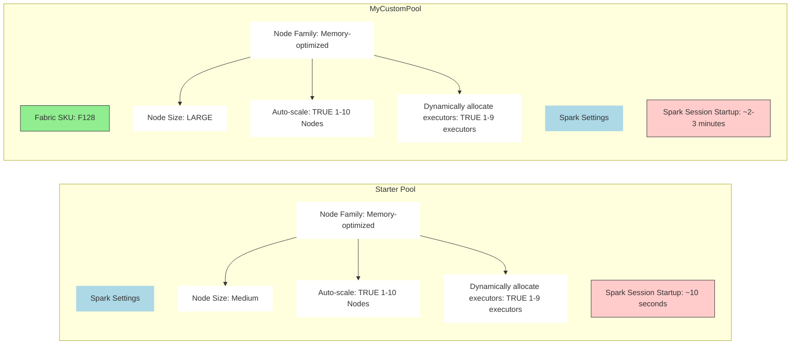

source: https://youtu.be/-64AAqSavfo?si=8eusFz0kVfxDP4kV

## summarize and extract

**Summary**  
The video discusses workspace settings relevant to data engineers in Microsoft Fabric, focusing on the following areas:

- Spark settings: Using the default Starter Pool in a Fabric notebook.
    
- Domains: Overview of a domain, from a Microsoft perspective, with an emphasis on how mapping organizational structure to Fabric domains helps with data discoverability.
    
- OneLake File Explorer: Accessing external data from other cloud platforms within Fabric.
    
- Shortcut Caching: Can be used to reduce egress costs.
    
- Apache Airflow job settings (aka Data Workflows).
    

**Key Insights**

- **Start with the defaults:** Most Data engineers will start with the "Starter Pool" in Spark settings when they write PySpark code within a Fabric notebook.
    
- **Domains for Data Discoverability:** Structuring your workspaces around domains (that align with your organization's structure) can help business users to locate the correct data.
    
- **OneLake File Explorer for integration:** Shortcuts allow access to external data in other cloud platforms, and OneLake File Explorer is designed to enable users in the context of data exploration and use.
    
- **Shortcut Caching benefits:** Shortcut caching is useful to reduce costs, specifically those associated with cross-cloud data access.
    
- **Apache Airflow Jobs (Data Workflows):** Microsoft provides a mechanism to run your DAG using a Pool.
    
- **The 24-Hour and 1GB Rule:** A file needs to be accessed within 24 hours, or it will be purged from the cache. Files greater than 1GB in size are not cached.
    
- **High Concurrency:** Multiple notebooks can use the same Spark application to help reduce the start time.
    
- **A note on Domains:** The fabric admin or the domain admin can create, delete, and configure domains.

## in-depth analysis
### In-depth Summary of Fabric Admin Settings for Data Engineers

This video provides a detailed look into administrative settings and configuration steps within Microsoft Fabric that are particularly relevant for Data Engineers. It covers how to optimize Spark workloads, manage data domains, interact with OneLake storage, and configure orchestration jobs.

---

#### **0:00 - Introduction & Agenda**

The video sets the stage for a DP-700 exam preparation course, focusing on essential admin settings and configuration steps in Microsoft Fabric that Data Engineers should be familiar with. The key topics to be covered include:

- Spark Settings
    
- Domains
    
- OneLake File Explorer
    
- Shortcut Caching
    
- Apache Airflow job settings
    

---

#### **0:28 - Spark Settings - Default Spark Pool**

- **Default Behavior:** When a Data Engineer runs PySpark code in a Fabric notebook, it automatically utilizes a default "Starter Pool."
    
- **Starter Pool Configuration:** This pool comes with predefined settings:
    
    - **Node Family:** Memory-optimized
        
    - **Node Size:** Medium
        
    - **Auto-scale:** Enabled (TRUE) to scale between 1 and 10 Nodes (this range can vary based on your Fabric SKU, e.g., F64).
        
    - **Dynamically allocate executors:** Enabled (TRUE) to allocate between 1 and 9 executors.
        
- **Benefits:** The Starter Pool offers a significant innovation in Fabric by providing near-instantaneous Spark session startup times (around 10 seconds), as Microsoft maintains these nodes globally, ensuring 24/7 availability.
    
- **Billing:** Users are only billed when Spark code is actively running on the Starter Pool, not when the pool is idle but available.
    
- **Core Concepts:**
    
    - **Node:** A commodity server used for distributed computing.
        
    - **Executor:** A Java Virtual Machine (JVM) process running on a node that performs tasks (computational units for data partitions). Spark leverages parallelism by splitting data into partitions and assigning tasks to multiple executors across nodes.
        

---

#### **3:25 - Limits of the Starter Pool & Custom Spark Pools**

While the Starter Pool is convenient, there are scenarios where a Custom Spark Pool becomes necessary:

- **Data Size:** For processing extremely large datasets (terabytes, petabytes), the Starter Pool's default medium nodes and limited scaling (up to 10 nodes) might become a bottleneck. A Custom Pool with increased node sizing (e.g., Large or XLarge) and higher maximum nodes can provide the necessary compute power.
    
- **Concurrency:** When multiple users or multiple jobs are simultaneously executing Spark code within the same Fabric capacity, they contend for the Starter Pool's limited resources. This can lead to resource contention and slower performance. A Custom Spark configuration helps manage resource allocation more effectively for high concurrency.
    
- **Variance in Job Resource Requirements:** If your workloads include a mix of very large, resource-intensive jobs and many smaller jobs, the Starter Pool might not be optimal. Custom Pools allow tailoring specific configurations (e.g., a large pool for big jobs, smaller pools for light jobs) to maximize efficiency and minimize cost.
    
- **Job Type:** Certain specialized tasks, like training complex machine learning models, often have unique resource demands that necessitate a customized Spark configuration for optimal performance.
    
- **Trade-off:** Creating and using a Custom Spark Pool typically leads to longer Spark session startup times (around 2-3 minutes) compared to the Starter Pool's near-instantaneous startup. This is because resources need to be spun up from scratch.
    

---

#### **5:37 - Where to Create and Manage Custom Spark Pools**

Fabric offers multiple ways to configure Spark pools and environments:

- **Option 1: In the Workspace Settings (Pool Tab):**
    
    - Users can navigate to "Workspace settings" and then the "Spark settings" section to find the "Pool" tab.
        
    - Here, you can choose the default pool for the workspace (either the Starter Pool or create a "New Pool").
        
    - Creating a new pool allows defining node family, size, autoscale ranges, and dynamic executor allocation.
        
    - **Impact:** Any notebooks or Spark jobs created or run within this specific workspace will use these configured settings by default.
        
    - **Limitations:** Settings configured directly here do not support Git integration (cannot be version-controlled) and cannot be reused across different workspaces.
        
- **Option 2: A Default Environment in your Workspace Settings (Environment Tab):**
    
    - Within "Spark settings," there's an "Environment" tab. An "Environment" is a special Fabric item designed to store Spark properties, Python libraries, and developer settings.
        
    - You can set a specific Environment as the "default environment" for your workspace.
        
    - **Impact:** All notebooks and Spark jobs in the workspace will use the settings defined within this default Environment.
        
    - **Benefits:** This approach allows for **Git integration**, meaning your Spark configurations and library dependencies can be version-controlled and deployed.
        
    - **Limitations:** Environments are still workspace-specific; you cannot directly reuse an Environment from one workspace in another. You would need to duplicate it (e.g., via Git operations).
        
- **Option 3: An Environment in your Workspace (but not the default for your Workspace):**
    
    - Instead of setting an Environment as the default for the entire workspace, you can simply create it as a Fabric item within the workspace.
        
    - **Impact:** This allows individual notebooks or Spark job definitions to explicitly select and use a specific Environment for their execution.
        
    - **Benefits:** Provides the most **optimal configuration per job/notebook**, as different workloads can leverage different environments tailored to their exact needs (e.g., one environment for large data transformations, another for small data exploration). It also retains the benefit of **Git integration**.
        
    - **Limitations:** Similar to Option 2, Environments are confined to the workspace they are created in; cross-workspace reuse requires duplication.
        

---

#### **11:30 - Other Spark Workspace Settings**

Beyond custom pools and environments, other Spark settings can influence performance and resource management:

- **Reserve Maximum Cores for Active Spark Jobs (Jobs Tab):**
    
    - This setting controls how Spark allocates cores based on a job's estimated needs.
        
    - **Default (Off - "Optimistic Execution Planning"):** Spark reserves the minimum required vCores (e.g., 24 for the Starter Pool) for a job. This is flexible, allowing more jobs to start, but might lead to resource contention if multiple jobs scale up simultaneously and available cores are exhausted.
        
    - **On ("Pessimistic Execution Planning"):** Spark reserves the maximum vCores it might need (e.g., 64 for the Starter Pool) at the start of the job. This ensures job stability and prevents scale-up failures due to resource scarcity. However, it can negatively impact other jobs by preemptively locking up resources that might not be fully utilized immediately.
        
- **High Concurrency (High Concurrency Tab):**
    
    - This feature aims to reduce Spark session startup times for repeated operations.
        
    - **For notebooks (On by default):** Allows a single user to connect multiple notebooks to the same underlying Spark application, preventing redundant session startups.
        
    - **For pipeline running multiple notebooks (Off by default):**Enables a data pipeline (e.g., using a ForEach activity to run several notebooks in parallel) to use the same Spark sessionfor all iterations. This requires configuring "Session Tags" in the pipeline's notebook activities to group them under one session.
        

---

#### **14:47 - Domains**

Domains in Fabric provide a logical layer for organizing data assets, aligning with business structures.

- **What's a Domain?** According to Microsoft, a domain logically groups all data within an organization that pertains to a specific business area or field. This often mirrors the company's organizational chart (e.g., Marketing, Sales, Finance, regional divisions).
    
- **Purpose & Benefits:**
    
    - **Mapping Business Structure:** Helps translate hierarchical or functional business structures into a manageable data organization within Fabric.
        
    - **Data Discoverability:** A primary benefit is improved data discoverability. In the OneLake Catalog, users can filter data items (Lakehouses, Warehouses, Semantic Models, etc.) by their assigned domain, making it easier to find relevant data assets.
        
- **Roles and Capabilities within Domains:** Fabric enforces different capabilities based on user roles:
    
    - **Fabric Admin:** (Tenant-level admin) Has full control: Can create/delete domains, appoint Domain Admins/Contributors, view/edit all domains, override delegated tenant settings, and assign workspaces to domains (both bulk and singular).
        
    - **Domain Admin:** Can appoint Domain Contributors, view/edit their own domains, override delegated tenant settings (if allowed by Fabric Admin), and assign workspaces to domains (bulk/singular). They have administrative control over specific domains.
        
    - **Domain Contributor (Workspace Admin):** Primarily focused on managing their own workspace. They can assign their specific workspace to a domain (singularly, via Workspace Settings).
        
- **Delegated Tenant Settings:** Fabric Admins can delegate certain tenant-level settings (e.g., Domain-level default sensitivity labels, Certification Settings) down to Domain Admins, allowing more granular control closer to the business units.
    

---

#### **17:50 - OneLake & OneLake File Explorer**

- **OneLake Overview:** OneLake is the unified, single-instance storage layer for all data in Microsoft Fabric, serving as the central "OneDrive for data." All Fabric compute engines (Data Factory, Data Engineering, Data Science, Data Warehousing, Real-Time Intelligence, Power BI) store and access their data within OneLake.
    
- **OneLake File Explorer:** This is a desktop application (similar to OneDrive for documents) that allows users to access and navigate their OneLake data directly from their local machine.
    
    - **Primary Use Case:** It provides a handy way for business users to interact with files (e.g., loading files into a Lakehouse) and view the underlying data structure of Fabric items.
        
- **Default Data Visibility in OneLake File Explorer:**
    
    - By default, only data from **Spark (Delta tables in Lakehouses)** and **Data Warehousing (Delta tables via SQL Endpoint)** are automatically written to OneLake and thus visible in the OneLake File Explorer.
        
    - **KQL Databases** and **Power BI Semantic Models** are notwritten to OneLake by default.
        
- **Enabling OneLake Integration for KQL Databases:**
    
    - **Step 1:** Within the UI of your KQL Database, turn on the "OneLake Availability" toggle.
        
    - **Crucial Note:** This setting only applies to new tables created in the KQL database after the feature is enabled. It will notbackfill existing data into OneLake (though a very recent update might offer an option for existing tables, as observed in the video demo). This means it's best to enable this early in the KQL database's lifecycle if you want full OneLake integration.
        
- **Enabling OneLake Integration for Power BI Semantic Models:**
    
    - This functionality only applies to Import mode semantic models/tables.
        
    - **Step 1:** Enable the functionality in the Tenant-level Admin Settings (this is a global setting managed by a Fabric Admin).
        
    - **Step 2:** Within the individual Power BI semantic model's settings, enable the "OneLake Integration" toggle. This will automatically write data imported into the semantic model to Delta tables in OneLake.
        
- **Broader Fabric Vision:** When KQL databases and Power BI semantic models data are explicitly written to OneLake, it unlocks their use in other Fabric experiences. For example, a Spark notebook can then directly query the Delta tables created by a Power BI semantic model, or a KQL database. This fosters a truly integrated data ecosystem.
    

---

#### **25:34 - Shortcut Caching**

- **Shortcuts:** A Fabric feature that allows you to access external data (e.g., from Amazon S3, Google Cloud Storage, or S3-compatible storage like Cloudflare) directly within Fabric without the need for traditional Extract, Transform, Load (ETL) processes. Fabric creates a logical link, and data is streamed on demand.
    
- **The Problem:** Accessing external data frequently incurs "egress costs" (charges for data leaving the external cloud provider's network).
    
- **Shortcut Caching Solution:** Microsoft has introduced "Shortcut Caching" to mitigate these costs. When enabled, Fabric creates a cache (a copy) of the data from the external shortcut within the Azure Cloud (specifically within your Fabric tenant). Subsequent reads from Fabric will hit this cache, reducing egress costs from the original external source.
    
- **Enabling:** This feature is enabled at the workspace level, under "Workspace settings" > "OneLake" > "Enable cache for shortcuts" toggle.
    
- **Key Caching Rules to be Aware Of:**
    
    - **24-Hour Rule:** If a cached file is not accessed for more than 24 hours, it will be automatically purged from the cache. The next access will then go back to the original source, incurring egress costs again.
        
    - **1GB Rule:** Individual files that are larger than 1 Gigabyte (GB) in size will not be cached. Accessing these large files will always result in hitting the original source and incurring egress costs.
        
    - **ADLS Gen2:** Shortcut caching is generally not applicable for shortcuts pointing to ADLS Gen2, as ADLS Gen2 is already an Azure-native storage solution within the Azure cloud environment.
        

---

#### **28:09 - Apache Airflow Jobs (aka Data Workflows)**

- **Definition:** Apache Airflow Jobs (formerly known as Data Workflows in Fabric previews) are a Fabric item designed to allow users to configure and run Apache Airflow Directed Acyclic Graphs (DAGs). These are powerful orchestration tools used to define, schedule, and monitor complex data pipelines, often written in Python.
    
- **Managed Service:** Traditionally, running Apache Airflow requires setting up and managing your own server or a hosted platform. Fabric provides a fully managed service, abstracting away the underlying infrastructure.
    
- **Pools for Execution:** Fabric allows you to create specific "Pools" (similar conceptually to Spark Pools, but for Airflow) to manage the compute resources for running your Airflow DAGs.
    
- **Configurable Settings (when creating a new pool):**
    
    - **Name:** A unique name for your Airflow runtime pool.
        
    - **Compute Node Size:** Defines the size of the compute nodes (e.g., Small, Medium, Large).
        
    - **Enable Autoscale:** Allows the pool to automatically scale resources up or down based on workload demand.
        
    - **Extra Nodes:** Option to manually specify additional nodes beyond the autoscale range.
        
- **Relevance for DP-700:** While the intricacies of building Airflow DAGs might not be a primary focus for the DP-700 exam, understanding that Fabric provides a managed service for Airflow, and knowing how to configure its underlying compute resources (via Pools), is valuable for Data Engineers. This also highlights Fabric's comprehensive approach to data orchestration alongside data processing.

## Walkthroughs
Here's a step-by-step guide to configure and manage settings relevant for Data Engineers in Microsoft Fabric, based on the video content:

---

### **1. Spark Settings (Custom Pools & Environments)**

Fabric provides a default "Starter Pool" for Spark workloads, offering quick startup times (around 10 seconds) due to pre-maintained nodes. However, for very large datasets, high concurrency, or varying job resource requirements, you might need custom Spark pools or environments.

**Limits of the Starter Pool & When to Use Custom Pools:**

- **Data Size:** For very large datasets that overwhelm the Starter Pool's default medium-sized nodes and 1-10 node auto-scaling.
    
- **Concurrency:** When multiple users or jobs are simultaneously trying to use Spark, potentially exhausting the limited resources of the Starter Pool.
    
- **Variance in Job Resource Requirements:** If you have jobs with vastly different compute needs (e.g., some very large, some very small), custom pools allow for optimized resource allocation per job type, rather than a one-size-fits-all approach.
    
- **Job Type:** Training large machine learning models often requires specialized or larger Spark configurations not available in the Starter Pool.
    

**Where to Create and Manage Custom Spark Pools/Environments:**

#### **Option 1: In the Workspace Settings (Default Pool for Workspace)**

This sets a default Spark pool for all notebooks and Spark jobs within that specific workspace. It does not allow Git integration of Spark settings or pool re-use across workspaces.

1. **Navigate to Workspace Settings:**
    
    - In Fabric, go to your desired workspace.
        
    - Click on the "Workspace settings" gear icon in the top right corner.
        
2. **Access Spark Settings:**
    
    - In the "Workspace settings" pane, under "Data Engineering/Science", click on "Spark settings".
        
3. **View Default Pool:**
    
    - The "Pool" tab is selected by default. You'll see "Default pool for workspace" set to "StarterPool".
        
4. **Create a New Custom Pool:**
    
    - Click the dropdown arrow next to "StarterPool".
        
    - Select "New pool".
        
    - In the "Create new pool" dialog:
        
        - Enter a "Spark pool name" (e.g., PoolDev).
            
        - "Node family" is fixed at "Memory optimized".
            
        - Select your desired "Node size" (e.g., Small, Medium, Large). This depends on your Fabric SKU.
            
        - Check "Enable autoscale" and adjust the minimum and maximum number of nodes.
            
        - Check "Enable dynamic allocation" and adjust the minimum and maximum number of executors.
            
        - Click "Create".
            
5. **Set as Default (Optional):**
    
    - After creation, you can select your new custom pool from the "Default pool for workspace" dropdown.
        
6. **Customize Compute Configurations for Items (Workspace-wide Override):**
    
    - Below the default pool settings, ensure "Customize compute configurations for items" is toggled "On". This allows users to override the workspace default Spark settings for individual notebooks or Spark job definitions.
        

#### **Option 2: As a Default Environment in your Workspace Settings**

An environment is a Fabric item that packages Spark properties, Python libraries, and developer settings. Setting a default environment for the workspace applies these settings to all notebooks and Spark jobs in that workspace. This option allows Git integration but still no pool re-use across workspaces.

1. **Navigate to Workspace Settings:**
    
    - Follow steps 1 from Option 1.
        
2. **Access Spark Settings:**
    
    - Follow steps 2 from Option 1.
        
3. **Set Default Environment:**
    
    - Click on the "Environment" tab.
        
    - Turn the "Set default environment" toggle "On".
        
4. **Create a New Environment:**
    
    - Click "New environment".
        
    - Enter a "Name" for the new environment (e.g., PoolDevEnv) and click "Create".
        
5. **Configure Environment Details:**
    
    - The new environment's settings page will load. Here you can configure:
        
        - **Libraries:** Built-in, Public, or Custom Python/Java/R libraries.
            
        - **Acceleration:** Enable Native execution engine (preview).
            
        - **Compute:**
            
            - "Environment pool": Select a pool (Default, or any custom pool created in Option 1).
                
            - Configure "Spark driver core", "Spark driver memory", "Spark executor core", "Spark executor memory".
                
            - Check "Enable dynamic allocation" and adjust "Spark executor instances".
                
        - **Spark Properties:** Add custom Spark properties.
            
        - **Storage & Resources:** Define custom storage and resources (less common for typical data engineering).
            
6. **Apply as Workspace Default:**
    
    - Go back to "Workspace settings" -> "Spark settings" -> "Environment" tab.
        
    - In the "Workspace default" dropdown, select your newly created environment (e.g., PoolDevEnv).
        

#### **Option 3: As an Environment Item in your Workspace (Not the Default)**

This approach allows for the most granular control, where specific notebooks or jobs can reference a particular environment. It offers optimal configuration per job and allows Git integration of the environment definition. The limitation is that environments are workspace-specific and cannot be directly shared or re-used across different workspaces.

1. **Create an Environment Item:**
    
    - Follow steps 1-5 from Option 2 to create an environment.
        
    - Do NOT set this environment as the "Default environment" in the Workspace Settings (keep the toggle "Off" or select another default).
        
2. **Reference the Environment in Notebooks/Jobs:**
    
    - Within an individual notebook or Spark job definition, you can explicitly select this environment to use its defined Spark settings and libraries. This allows different jobs within the same workspace to use different Spark configurations.
        

---

### **2. Domains**

Domains logically group data within an organization based on business areas or fields. This helps with data discoverability in the OneLake Catalog.

**Key Steps for Domain Setup:**

1. **Get your Business Org Chart:** Understand your organization's structure (e.g., regional, functional departments like Marketing, Sales, HR).
    
2. **Map Org Structure to Fabric Domains (and Subdomains):**Design your domain hierarchy in Fabric to align with your business units.
    
3. **Assign Workspaces to Domain(s):**
    
    - This can be done in bulk via "Domain Settings" (by workspace name, workspace admin, or capacity).
        
    - Or singularly within "Workspace Settings" -> "General" tab, by selecting the domain from the "Domain" dropdown.
        

**Roles and Capabilities for Domains:**

|   |   |   |   |
|---|---|---|---|
|Task|Fabric Admin|Domain Admin|Domain Contributor (Workspace Admin)|
|Create & delete domains|✅|❌|❌|
|Appoint Domain Admins|✅|❌|❌|
|View and edit all domains|✅|❌|❌|
|Appoint Domain Contributors|✅|✅|❌|
|View and edit their own domains|✅|✅|❌|
|Override delegated tenant settings*|✅|✅|❌|
|Assign workspaces to domains (bulk, in Domain Settings)|✅|✅|❌|
|Assign workspaces to domains (singular, in Workspace Settings)|✅|✅|✅|

*Delegated tenant settings include Domain-level default sensitivity label and Certification Settings.

---

### **3. OneLake File Explorer & Integration**

OneLake is the unified data lake for Microsoft Fabric, making all Fabric data accessible from a single location. The OneLake File Explorer makes this data accessible on your local machine, similar to OneDrive.

**Key Points:**

- By default, only Spark-generated Delta tables and Data Warehouse tables are directly written to OneLake and viewable in OneLake File Explorer.
    
- KQL Databases and Power BI Semantic Models (Import mode) do not write their data to OneLake by default. This needs to be explicitly enabled.
    

**Enabling OneLake Integration for KQL Database:**

1. **Navigate to KQL Database:**
    
    - In Fabric, navigate to your KQL Database (e.g., Eventhouse_OneLakeDemo).
        
2. **Turn on OneLake Availability:**
    
    - In the KQL Database UI, on the right-hand overview pane (or toolbar), locate the "OneLake" section.
        
    - Toggle "Availability" from "Off" to "On".
        
    - A popup "Turn on OneLake availability" will appear. It notes that "Only new data will be added to new and existing tables."
        
    - **Crucial Note:** Until recently, this only applied to new tables. Fabric has introduced a new option: check "Apply to existing tables" in the popup to backfill existing data into OneLake.
        
    - Click "Turn on".
        
3. **Verify in OneLake File Explorer:**
    
    - Open your local OneLake File Explorer.
        
    - Right-click on "OneLake (Microsoft Preview)" and select "Sync from OneLake" to refresh.
        
    - Navigate to your KQL database folder (e.g., Eventhouse_OneLakeDemo.KustoDatabase) -> Tables -> [YourTableName] -> delta_log. You should now see the delta files for your KQL table.
        

**Enabling OneLake Integration for Power BI Semantic Models (Import Mode):**

1. **Enable Tenant-Level Setting:**
    
    - This is a prerequisite. A Fabric Admin must enable this functionality in the Tenant-level Admin Settings.
        
2. **Enable Integration within Semantic Model Settings:**
    
    - In Fabric, navigate to your semantic model (e.g., SM_OneLakeDemo).
        
    - Click the ellipsis (...) next to the semantic model name and select "Settings".
        
    - Scroll down to "OneLake Integration".
        
    - Toggle the "Off" switch to "On".
        
    - Click "Apply".
        
3. **Verify in OneLake File Explorer:**
    
    - Refresh your local OneLake File Explorer.
        
    - Navigate to your semantic model folder (e.g., SM_OneLakeDemo.SemanticModel) -> Tables. You should now see delta tables corresponding to the import mode tables in your semantic model.
        
    - **Note:** This only applies to **Import mode** semantic models/tables. DirectQuery models do not write data to OneLake.
        

---

### **4. Shortcut Caching**

Shortcuts allow you to access external data from other cloud platforms (like Amazon S3, Google Cloud Storage, or ADLS Gen2) directly within Fabric without needing traditional ETL processes. Shortcut caching helps reduce egress costs associated with cross-cloud data access.

1. **Navigate to OneLake Settings:**
    
    - In your Fabric workspace, click on "Workspace settings" (gear icon).
        
    - Under "Data Engineering/Science", click on "OneLake".
        
2. **Enable Cache for Shortcuts:**
    
    - Under "Shortcut Settings", toggle "Enable cache for shortcuts" to "On".
        
    - Data accessed through shortcuts in this workspace will now be cached in OneLake.
        

**Key Caching Rules to be Aware Of:**

- **24-Hour Rule:** If a cached file hasn't been accessed for more than 24 hours, it's automatically purged from the cache. The next access will go back to the source.
    
- **1GB Rule:** Individual files larger than 1GB in size are not cached.
    
- **Compatibility:** Caching is available for Amazon S3, Google Cloud Storage, and Amazon S3-compatible storage (e.g., Cloudflare). It's not available for Azure Data Lake Storage Gen2 (ADLS Gen2) as this is considered "in-cloud" and does not incur cross-cloud egress costs.
    

---

### **5. Apache Airflow Job Settings (aka Data Workflows)**

Apache Airflow jobs (previously known as Data Workflows) are a preview Fabric item that allows you to configure and run Apache Airflow DAGs (directed acyclic graphs) for orchestration. Fabric provides a managed mechanism to run your DAGs using a Pool.

1. **Navigate to Data Workflows:**
    
    - In Fabric, select the "Data Factory" workload from the left navigation pane.
        
    - Under "Data Factory", click on "Data workflows (preview)".
        
2. **Create a New Pool for Apache Airflow Runtime:**
    
    - Click "New Data workflow".
        
    - In the "Create new pool" dialog:
        
        - Enter a "Name" for your pool (e.g., MyAirflowRuntime).
            
        - Select the "Compute node size" (e.g., Small, Medium, Large).
            
        - Check "Enable autoscale" to allow scaling up and down based on activity.
            
        - Adjust "Extra nodes" if you need additional fixed nodes beyond autoscaling.
            
        - Click "Create".
            

This managed service handles the underlying server and infrastructure for your Airflow DAGs, allowing you to focus on your orchestration logic.

## Diagrams

``` mermaid
graph TD
    A[So where can I create and manage custom Spark Pools?]

    subgraph Option 1: In the Workspace Settings
        WS_Pool[Spark settings: Pool Tab]
        SP_Details[Default pool for workspace: StarterPool]
        WS_Pool --> SP_Details
        SP_Details --> Edit_Pool[Edit Pool Details / Create New Pool]
        Note1[All notebooks and Spark Jobs in the Workspace will use these Settings ]
        Feature1_X(X No Git integration)
        Feature2_X(X No pool re-use across workspace)
    end

    subgraph Option 2: A Default Environment in your Workspace Settings
        WS_Env[Spark settings: Environment Tab]
        Set_Default_Env[Set default environment: On]
        WS_Env --> Set_Default_Env
        Set_Default_Env --> Workspace_Default[Workspace default: PoolDevEnv]
        Compute_Settings[Compute: Spark driver/executor core & memory, Dynamic allocation]
        Note2[All notebooks and Spark Jobs in the Workspace will use these Settings ]
        Feature3_OK(✔ Allows Git integration through Environment)
        Feature4_X(X No pool re-use across workspace)
    end

    subgraph Option 3: An Environment in your Workspace
        WS_Item[Workspace Settings: Environment Item]
        Data_Eng_Env[DATA_ENG_ENV]
        WS_Item --> Data_Eng_Env
        Data_Eng_Env --> Loading_Notebook[Loading Notebook uses DATA_ENG_ENV]
        Data_Eng_Env --> Transform_Notebook[Transform Notebook uses DATA_ENG_ENV]
        Note3[Optimal configuration for each notebook/job]
        Feature5_OK(✔ Allows Git integration)
        Feature6_X(X Can't use an Environment from another Workspace)
    end

    style WS_Pool fill:#e6e6fa,stroke:#333,stroke-width:1px;
    style WS_Env fill:#e6e6fa,stroke:#333,stroke-width:1px;
    style WS_Item fill:#e6e6fa,stroke:#333,stroke-width:1px;
    style Compute_Settings fill:#dcdcdc,stroke:#333,stroke-width:1px;
    style Data_Eng_Env fill:#add8e6,stroke:#333,stroke-width:1px;
    style SP_Details fill:#FFFFFF,stroke:none;
    style Edit_Pool fill:#FFFFFF,stroke:none;
    style Note1 fill:#FFFFFF,stroke:none;
    style Feature1_X fill:#FF0000,stroke:none;
    style Feature2_X fill:#FF0000,stroke:none;
    style Set_Default_Env fill:#FFFFFF,stroke:none;
    style Workspace_Default fill:#FFFFFF,stroke:none;
    style Note2 fill:#FFFFFF,stroke:none;
    style Feature3_OK fill:#008000,stroke:none;
    style Feature4_X fill:#FF0000,stroke:none;
    style Loading_Notebook fill:#FFFFFF,stroke:none;
    style Transform_Notebook fill:#FFFFFF,stroke:none;
    style Note3 fill:#FFFFFF,stroke:none;
    style Feature5_OK fill:#008000,stroke:none;
    style Feature6_X fill:#FF0000,stroke:none;
```

![[Pasted image 20250607160100.png]]

